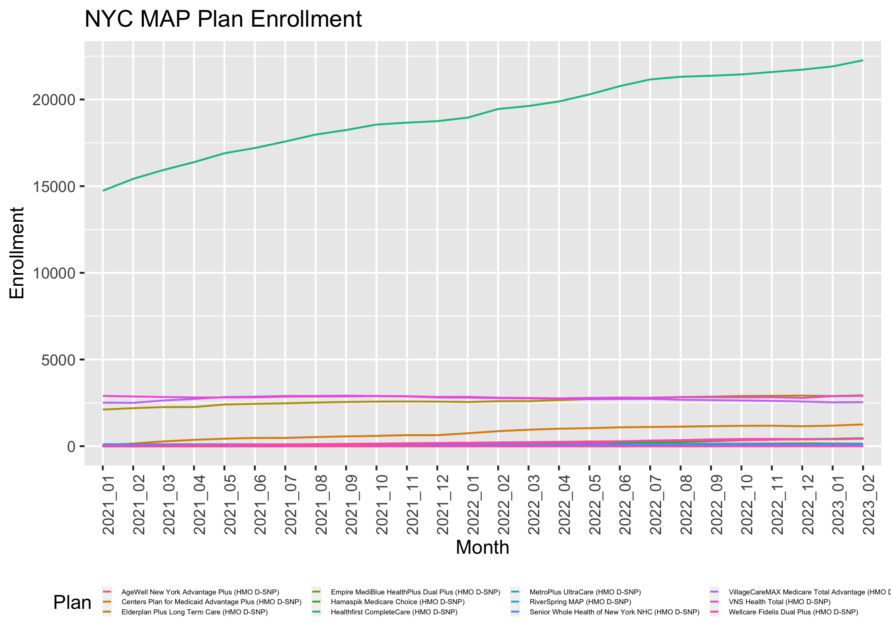

CMS Monthly Enrollment Data Extraction - All Months
================
Sarah Forrest

``` r
library(tidyverse)
library(stringr)
library(gdata)
```

Monthly enrollment data at the contract/plan/state/county level was
downloaded from CMS here:
<https://www.cms.gov/Research-Statistics-Data-and-Systems/Statistics-Trends-and-Reports/MCRAdvPartDEnrolData/Monthly-Enrollment-by-Contract-Plan-State-County>

The downloaded folders contain 2 files: an enrollment data file and a
contract data file. Both files share the following common fields:
`contract_number` (= `contract_id`) and `plan_id`. These two fields
combined make up the H-number.

The function below called `enrollment_data` reading in these files and
creates 2 output files–one for MAP plans and one for MA D-SNP plans for
any given month. The output dataset is restricted to health plans
(i.e. H-numbers) of interest only. The function merges the contract data
file and the enrollment data file together using the shared fields
`contract_number` (= `contract_id`) and `plan_id`. Then, it pivots the
datasets to wide format and calculates the following “total” variables:

-   New York City Total: `nyc_total` = the sum across New York, Bronx,
    Kings, Queens, and Richmond counties
-   New York City Metro Total: `nyc_metro_total` = the sum across NYC
    counties plus Nassau, Suffolk, Westchester, and Rockland counties
-   New York State Total: `nys_total` = the sum across all counties in
    New York

Finally, the function saves the resulting datasets in the R enviornment
and creates a CSV file for both the MAP plan dataset and the MA D-SNP
plan dataset.

``` r
enrollment_data <- function(yyyy_mm) {
  
  path_enroll = str_c("data/raw_data/CPSC_Enrollment_", yyyy_mm, "/CPSC_Enrollment_Info_", yyyy_mm, ".csv")
  path_contract = str_c("data/raw_data/CPSC_Enrollment_", yyyy_mm, "/CPSC_Contract_Info_", yyyy_mm, ".csv")

  enroll <- read_csv(path_enroll) %>%
    filter(State == "NY") %>%
    janitor::clean_names()
  
  contract_map <- read_csv(path_contract) %>%
  janitor::clean_names() %>%
  mutate(h_number = str_c(contract_id, '-', plan_id)) %>%
  filter(h_number %in% c("H3359-034", "H5549-003", "H3347-007", "H2168-002", "H6988-004", "H5599-003", "H0034-002", "H1732-001", "H5992-007", "H6776-002", "H4922-010", "H0423-007", "H5599-008"))
  
  contract_madsnp = read_csv(path_contract) %>%
  janitor::clean_names() %>%
  mutate(h_number = str_c(contract_id, '-', plan_id)) %>%
  filter(h_number %in% c("H3312-069", "H4922-003", "H6988-002", "H3347-002", "H3330-042", "H5991-010", "H8432-007", "H8432-028", "H1732-003", "H0034-001", "H3359-021", "H3533-034", "H5970-026", "H0423-001", "H5992-008", "H0271-060", "H3387-014", "H3387-015", "H2168-001", "H2168-003","H5549-011", "H5599-001"))
  

map = 
  inner_join(enroll, contract_map, by = c("contract_number" = "contract_id", "plan_id" = "plan_id")) %>%
  select(h_number, contract_number, plan_id, organization_marketing_name, plan_name, plan_type, county, enrollment) %>%
  mutate(enrollment = case_when(enrollment == "*" ~ "0", enrollment != "*" ~ enrollment)) %>%
  mutate(enrollment = as.numeric(enrollment)) %>%
  pivot_wider(names_from = county, values_from = enrollment) %>%
  janitor::clean_names() %>%
  select(order(colnames(.))) %>%
  select(h_number, contract_number, plan_id, organization_marketing_name, plan_name, plan_type, everything()) %>%
  mutate(
    nyc_total = (sum = rowSums(dplyr::select(., new_york, bronx, kings, queens, richmond), na.rm = TRUE)),
    nyc_metro_total = (sum = rowSums(dplyr::select(., new_york, bronx, kings, queens, richmond, nassau, suffolk, westchester, rockland), na.rm = TRUE)),
    nys_total = (sum = rowSums(dplyr::select(., albany:westchester), na.rm = TRUE))) %>% # only to westchester here rather than yates because files from 2021 and earlier don't have a column for yates
  select(organization_marketing_name, plan_name, h_number, contract_number, plan_id, plan_type, nyc_total, nyc_metro_total, nys_total, everything())
        
madsnp = 
  inner_join(enroll, contract_madsnp, by = c("contract_number" = "contract_id", "plan_id" = "plan_id")) %>%
  select(h_number, contract_number, plan_id, organization_marketing_name, plan_name, plan_type, county, enrollment) %>%
  mutate(enrollment = case_when(enrollment == "*" ~ "0", enrollment != "*" ~ enrollment)) %>%
  mutate(enrollment = as.numeric(enrollment)) %>%
  pivot_wider(names_from = county, values_from = enrollment) %>%
  janitor::clean_names() %>%
  select(order(colnames(.))) %>%
  select(h_number, contract_number, plan_id, organization_marketing_name, plan_name, plan_type, everything()) %>%
  mutate(
    nyc_total = (sum = rowSums(dplyr::select(., new_york, bronx, kings, queens, richmond), na.rm = TRUE)),
    nyc_metro_total = (sum = rowSums(dplyr::select(., new_york, bronx, kings, queens, richmond, nassau, suffolk, westchester, rockland), na.rm = TRUE)),
    nys_total = (sum = rowSums(dplyr::select(., albany:yates), na.rm = TRUE))) %>%
  select(organization_marketing_name, plan_name, h_number, contract_number, plan_id, plan_type, nyc_total, nyc_metro_total, nys_total, everything())


map_blank <- map %>% # replicate dataset to create a blank version
  select(-organization_marketing_name, -contract_number, -plan_id, -plan_type) # select only necessary variables
map_blank <- sapply(map_blank, as.character) 
map_blank[is.na(map_blank)] <- "" # replace NA with blank

madsnp_blank <- madsnp %>% # replicate dataset to create a blank version
  select(-organization_marketing_name, -contract_number, -plan_id, -plan_type) # select only necessary variables
madsnp_blank <- sapply(madsnp_blank, as.character) 
madsnp_blank[is.na(madsnp_blank)] <- "" # replace NA with blank


df_name_map = str_c("map_", yyyy_mm)
df_name_madsnp = str_c("madsnp_", yyyy_mm)

assign(x = df_name_map, value = map, envir = globalenv()) # or map_blank
assign(x = df_name_madsnp, value = madsnp, envir = globalenv()) # or madsnp_blank

save_path_map = str_c("data/output_data/map/", df_name_map, ".csv")
save_path_madsnp = str_c("data/output_data/madsnp/", df_name_madsnp, ".csv")

write.csv(map_blank,save_path_map, row.names = TRUE)
write.csv(madsnp_blank, save_path_madsnp, row.names = TRUE)
}
```

The `enrollment_data` function above is applied to all months of data
from 2021 - present.

``` r
enrollment_data(yyyy_mm = "2023_02")  # Note: must add new row above here for new months after 02/2023
enrollment_data(yyyy_mm = "2023_01")
enrollment_data(yyyy_mm = "2022_12")
enrollment_data(yyyy_mm = "2022_11")
enrollment_data(yyyy_mm = "2022_10")
enrollment_data(yyyy_mm = "2022_09")
enrollment_data(yyyy_mm = "2022_08")
enrollment_data(yyyy_mm = "2022_07")
enrollment_data(yyyy_mm = "2022_06")
enrollment_data(yyyy_mm = "2022_05")
enrollment_data(yyyy_mm = "2022_04")
enrollment_data(yyyy_mm = "2022_03")
enrollment_data(yyyy_mm = "2022_02")
enrollment_data(yyyy_mm = "2022_01")
enrollment_data(yyyy_mm = "2021_12")
enrollment_data(yyyy_mm = "2021_11")
enrollment_data(yyyy_mm = "2021_10")
enrollment_data(yyyy_mm = "2021_09")
enrollment_data(yyyy_mm = "2021_08")
enrollment_data(yyyy_mm = "2021_07")
enrollment_data(yyyy_mm = "2021_06")
enrollment_data(yyyy_mm = "2021_05")
enrollment_data(yyyy_mm = "2021_04")
enrollment_data(yyyy_mm = "2021_03")
enrollment_data(yyyy_mm = "2021_02")
enrollment_data(yyyy_mm = "2021_01")
```

The functions below create time series datasets for MAP and MA D-SNP
plans by Region (NYC, NYC Metro Area, NYS)

NYC MAP:

``` r
# initialize nyc_map as an empty dataframe
nyc_map <- data.frame()

# iterate over each month and year
for (year in 2021:2023) {
  for (month in 1:12) {
    # create the name of the dataframe to be merged
    map_name <- paste0("map_", year, "_", sprintf("%02d", month))
    
    # check if object exists
    if (exists(map_name)) {
      # merge the current dataframe with nyc_metro_map
      if (nrow(nyc_map) == 0) {
        # if nyc_metro_map is empty, just add the current dataframe to it
        nyc_map <- get(map_name)[ , c("h_number", "nyc_total")]
      } else {
        # if nyc_metro_map is not empty, merge the current dataframe with it
        merge_cols <- c("h_number")
        nyc_map <- merge(nyc_map, 
                         get(map_name)[ , c("h_number", "nyc_total")], 
                         by = merge_cols,
                         all = TRUE)
        # clean up suffixes in column names
        colnames(nyc_map) <- gsub("_x$", "", colnames(nyc_map))
        colnames(nyc_map) <- gsub("_y$", "", colnames(nyc_map))
      }
    } else {
      # object does not exist, so skip this iteration
      next
    }
  }
}
```

NYC Metro MAP:

``` r
# initialize nyc_metro_map as an empty dataframe
nyc_metro_map <- data.frame()

# iterate over each month and year
for (year in 2021:2023) {
  for (month in 1:12) {
    # create the name of the dataframe to be merged
    map_name <- paste0("map_", year, "_", sprintf("%02d", month))
    
    # check if object exists
    if (exists(map_name)) {
      # merge the current dataframe with nyc_metro_metro_map
      if (nrow(nyc_metro_map) == 0) {
        # if nyc_metro_metro_map is empty, just add the current dataframe to it
        nyc_metro_map <- get(map_name)[ , c("h_number", "nyc_metro_total")]
      } else {
        # if nyc_metro_metro_map is not empty, merge the current dataframe with it
        merge_cols <- c("h_number")
        nyc_metro_map <- merge(nyc_metro_map, 
                         get(map_name)[ , c("h_number", "nyc_metro_total")], 
                         by = merge_cols,
                         all = TRUE)
        # clean up suffixes in column names
        colnames(nyc_metro_map) <- gsub("_x$", "", colnames(nyc_metro_map))
        colnames(nyc_metro_map) <- gsub("_y$", "", colnames(nyc_metro_map))
      }
    } else {
      # object does not exist, so skip this iteration
      next
    }
  }
}
```

NYS MAP:

``` r
# initialize nys_map as an empty dataframe
nys_map <- data.frame()

# iterate over each month and year
for (year in 2021:2023) {
  for (month in 1:12) {
    # create the name of the dataframe to be merged
    map_name <- paste0("map_", year, "_", sprintf("%02d", month))
    
    # Check if object exists
    if (exists(map_name)) {
      # merge the current dataframe with nys_metro_map
      if (nrow(nys_map) == 0) {
        # if nys_metro_map is empty, just add the current dataframe to it
        nys_map <- get(map_name)[ , c("h_number", "nys_total")]
      } else {
        # if nys_metro_map is not empty, merge the current dataframe with it
        merge_cols <- c("h_number")
        nys_map <- merge(nys_map, 
                         get(map_name)[ , c("h_number", "nys_total")], 
                         by = merge_cols,
                         all = TRUE)
        # clean up suffixes in column names
        colnames(nys_map) <- gsub("_x$", "", colnames(nys_map))
        colnames(nys_map) <- gsub("_y$", "", colnames(nys_map))
      }
    } else {
      # object does not exist, so skip this iteration
      next
    }
  }
}
```

NYC MA D-SNP:

``` r
# initialize nyc_madsnp as an empty dataframe
nyc_madsnp <- data.frame()

# iterate over each month and year
for (year in 2021:2023) {
  for (month in 1:12) {
    # create the name of the dataframe to be merged
    madsnp_name <- paste0("madsnp_", year, "_", sprintf("%02d", month))
    
    # check if object exists
    if (exists(madsnp_name)) {
      # merge the current dataframe with nyc_metro_madsnp
      if (nrow(nyc_madsnp) == 0) {
        # if nyc_metro_madsnp is empty, just add the current dataframe to it
        nyc_madsnp <- get(madsnp_name)[ , c("h_number", "nyc_total")]
      } else {
        # if nyc_metro_madsnp is not empty, merge the current dataframe with it
        merge_cols <- c("h_number")
        nyc_madsnp <- merge(nyc_madsnp, 
                         get(madsnp_name)[ , c("h_number", "nyc_total")], 
                         by = merge_cols,
                         all = TRUE)
        # clean up suffixes in column names
        colnames(nyc_madsnp) <- gsub("_x$", "", colnames(nyc_madsnp))
        colnames(nyc_madsnp) <- gsub("_y$", "", colnames(nyc_madsnp))
      }
    } else {
      # object does not exist, so skip this iteration
      next
    }
  }
}
```

NYC Metro MA D-SNP:

``` r
# initialize nyc_metro_madsnp as an empty dataframe
nyc_metro_madsnp <- data.frame()

# iterate over each month and year
for (year in 2021:2023) {
  for (month in 1:12) {
    # create the name of the dataframe to be merged
    madsnp_name <- paste0("madsnp_", year, "_", sprintf("%02d", month))
    
    # check if object exists
    if (exists(madsnp_name)) {
      # merge the current dataframe with nyc_metro_metro_madsnp
      if (nrow(nyc_metro_madsnp) == 0) {
        # if nyc_metro_metro_madsnp is empty, just add the current dataframe to it
        nyc_metro_madsnp <- get(madsnp_name)[ , c("h_number", "nyc_metro_total")]
      } else {
        # if nyc_metro_metro_madsnp is not empty, merge the current dataframe with it
        merge_cols <- c("h_number")
        nyc_metro_madsnp <- merge(nyc_metro_madsnp, 
                         get(madsnp_name)[ , c("h_number", "nyc_metro_total")], 
                         by = merge_cols,
                         all = TRUE)
        # clean up suffixes in column names
        colnames(nyc_metro_madsnp) <- gsub("_x$", "", colnames(nyc_metro_madsnp))
        colnames(nyc_metro_madsnp) <- gsub("_y$", "", colnames(nyc_metro_madsnp))
      }
    } else {
      # object does not exist, so skip this iteration
      next
    }
  }
}
```

NYS MA D-SNP:

``` r
# initialize nys_madsnp as an empty dataframe
nys_madsnp <- data.frame()

# iterate over each month and year
for (year in 2021:2023) {
  for (month in 1:12) {
    # create the name of the dataframe to be merged
    madsnp_name <- paste0("madsnp_", year, "_", sprintf("%02d", month))
    
    # check if object exists
    if (exists(madsnp_name)) {
      # merge the current dataframe with nys_metro_madsnp
      if (nrow(nys_madsnp) == 0) {
        # if nys_metro_madsnp is empty, just add the current dataframe to it
        nys_madsnp <- get(madsnp_name)[ , c("h_number", "nys_total")]
      } else {
        # if nys_metro_madsnp is not empty, merge the current dataframe with it
        merge_cols <- c("h_number")
        nys_madsnp <- merge(nys_madsnp, 
                         get(madsnp_name)[ , c("h_number", "nys_total")], 
                         by = merge_cols,
                         all = TRUE)
        # Clean up suffixes in column names
        colnames(nys_madsnp) <- gsub("_x$", "", colnames(nys_madsnp))
        colnames(nys_madsnp) <- gsub("_y$", "", colnames(nys_madsnp))
      }
    } else {
      # object does not exist, so skip this iteration
      next
    }
  }
}
```

Add column names to all MAP and MA D-SNP dataframes

``` r
# create column names vector
col_name_vector_forward = c("h_number", "2021_01", "2021_02", "2021_03", "2021_04", "2021_05", "2021_06", "2021_07", "2021_08", "2021_09", "2021_10", "2021_11", "2021_12", "2022_01", "2022_02", "2022_03", "2022_04", "2022_05", "2022_06", "2022_07", "2022_08", "2022_09", "2022_10", "2022_11", "2022_12", "2023_01", "2023_02") # Note: must add new column name here for new months after 02/2023

# applying colnames
  # map datasets
colnames(nyc_map) = col_name_vector_forward
colnames(nyc_metro_map) = col_name_vector_forward
colnames(nys_map) = col_name_vector_forward

  # madsnp datasets
colnames(nyc_madsnp) = col_name_vector_forward
colnames(nyc_metro_madsnp) = col_name_vector_forward
colnames(nys_madsnp) = col_name_vector_forward
```

Add `plan_name` column to the datasets by merging a month dataset with
the time series dataset using the H-Number

``` r
# Restrict month dataset to only the columns of interest (plan_name, h_number)
map_plan_names <- map_2023_02 %>%
  select(plan_name, h_number) 

madsnp_plan_names <- madsnp_2023_02 %>%
  select(plan_name, h_number)

# join the datasets and move plan_name to the front
  # map datasets
nyc_map <- inner_join(nyc_map, map_plan_names, by = "h_number") %>%
  select(plan_name, everything())

nyc_metro_map <- inner_join(nyc_metro_map, map_plan_names, by = "h_number") %>%
  select(plan_name, everything())

nys_map <- inner_join(nys_map, map_plan_names, by = "h_number") %>%
  select(plan_name, everything())

  # madsnp datasets
nyc_madsnp <- inner_join(nyc_madsnp, madsnp_plan_names, by = "h_number") %>%
  select(plan_name, everything())
nyc_madsnp[is.na(nyc_madsnp)] <- 0 # replace NA with 0s

nyc_metro_madsnp <- inner_join(nyc_metro_madsnp, madsnp_plan_names, by = "h_number") %>%
  select(plan_name, everything())
nyc_metro_madsnp[is.na(nyc_metro_madsnp)] <- 0 # replace NA with 0s

nys_madsnp <- inner_join(nys_madsnp, madsnp_plan_names, by = "h_number") %>%
  select(plan_name, everything())
nys_madsnp[is.na(nys_madsnp)] <- 0 # replace NA with 0s
```

``` r
# save datasets as CSV files
  # map datasets
write.csv(nyc_map, "data/output_data/map/nyc_map.csv", row.names = TRUE)
write.csv(nyc_metro_map, "data/output_data/map/nyc_metro_map.csv", row.names = TRUE)
write.csv(nys_map, "data/output_data/map/nys_map.csv", row.names = TRUE)

  # madsnp datasets
write.csv(nyc_madsnp, "data/output_data/madsnp/nyc_madsnp.csv", row.names = TRUE)
write.csv(nyc_metro_madsnp, "data/output_data/madsnp/nyc_metro_madsnp.csv", row.names = TRUE)
write.csv(nys_madsnp, "data/output_data/madsnp/nys_madsnp.csv", row.names = TRUE)
```

# Plots for NYC Enrollment Data

## MAP Plans

``` r
# first pivot data to long format 
nyc_map_long <-
  nyc_map %>%
   pivot_longer(
    "2021_01":"2023_02",
    names_to = "month",
    values_to = "enrollment",
    names_prefix = "month") 

nyc_map_long %>%  
  ggplot(aes(x = month, y = enrollment, group = plan_name, color = plan_name)) + 
  geom_path() + 
  theme(axis.text.x = element_text(angle = 90, hjust = 1)) +
  theme(legend.position = "bottom", legend.box = "horizontal") + 
  theme(legend.text = element_text(size = 4.0),
        legend.key.size = unit(0.2, "cm")) + 
  labs(
    title = "NYC MAP Plan Enrollment",
    x = "Month",
    y = "Enrollment",
    color = "Plan")
```

<!-- -->

``` r
# limited y-axis range - healthfirst removed
nyc_map_long %>%  
  ggplot(aes(x = month, y = enrollment, group = plan_name, color = plan_name)) + 
  geom_path() + 
  ylim(0, 3500) +
  theme(axis.text.x = element_text(angle = 90, hjust = 1)) +
  theme(legend.position = "bottom", legend.box = "horizontal") + 
  theme(legend.text = element_text(size = 3.0),
        legend.key.size = unit(0.2, "cm")) + 
  labs(
    title = "NYC MAP Plan Enrollment",
    x = "Month",
    y = "Enrollment",
    color = "Plan")
```

<!-- -->

## MA D-SNP Plans

``` r
# first pivot data to long format 
nyc_madsnp_long <-
  nyc_madsnp %>%
   pivot_longer(
    "2021_01":"2023_02",
    names_to = "month",
    values_to = "enrollment",
    names_prefix = "month") 

nyc_madsnp_long %>%  
  ggplot(aes(x = month, y = enrollment, group = plan_name, color = plan_name)) + 
  geom_path() + 
  theme(axis.text.x = element_text(angle = 90, hjust = 1)) +
  theme(legend.position = "bottom", legend.box = "horizontal") + 
  theme(legend.text = element_text(size = 4.0),
        legend.key.size = unit(0.2, "cm")) + 
  labs(
    title = "NYC MA D-SNP Plan Enrollment",
    x = "Month",
    y = "Enrollment",
    color = "Plan")
```

<!-- -->

``` r
# limited y-axis range - healthfirst and 1 united plan removed
nyc_madsnp_long %>%  
  ggplot(aes(x = month, y = enrollment, group = plan_name, color = plan_name)) + 
  geom_path() + 
  ylim(0, 30000) +
  theme(axis.text.x = element_text(angle = 90, hjust = 1)) +
  theme(legend.position = "bottom", legend.box = "horizontal") + 
  theme(legend.text = element_text(size = 3.0),
        legend.key.size = unit(0.1, "cm")) + 
  labs(
    title = "NYC MA D-SNP Plan Enrollment",
    x = "Month",
    y = "Enrollment",
    color = "Plan")
```

<!-- -->
